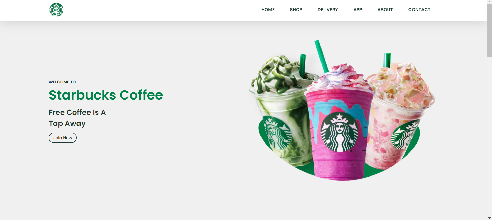

# StarbucksLandingPage ☕️

Este é um projeto simples de uma página de destino (landing page) da Starbucks, criada utilizando apenas HTML e CSS. O foco principal do projeto foi replicar o design visual de uma página fictícia da marca, sem funcionalidades dinâmicas ou integração de JavaScript.

## 🛠️ Tecnologias Utilizadas

- **HTML5**: Estruturação da página.
- **CSS3**: Estilização e design responsivo.

## 💡 Funcionalidades

- Layout totalmente responsivo para diferentes tamanhos de tela.
- Design moderno e atraente inspirado na marca Starbucks.
- Uso de Flexbox para organização dos elementos.

## 📸 Prévia do Projeto



## 🚀 Como Executar o Projeto

1. Clone este repositório:
   ```bash
   git clone https://github.com/seu-usuario/StarbucksLandingPage.git
   ```

2. Navegue até o diretório do projeto:
   ```bash
   cd StarbucksLandingPage
   ```

3. Abra o arquivo `index.html` em qualquer navegador para visualizar a página.

## 📄 Licença

Este projeto é livre para uso pessoal ou educacional.

